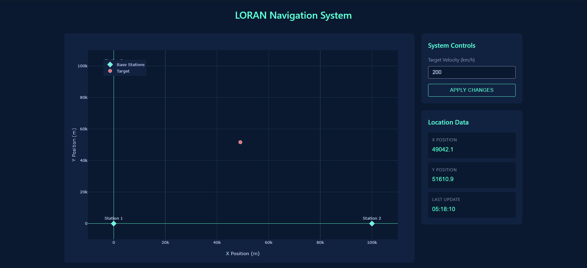

# Лабораторна робота 6: Розробка додатку для візуалізації вимірювань LORAN

## Мета роботи
Розробка веб-додатку для візуалізації даних навігаційної системи LORAN з використанням методу гіперболічного позиціонування. Додаток повинен відображати положення об'єкта та базових станцій у реальному часі та надавати можливість керування параметрами системи.

## Теоретичні відомості
Система LORAN (Long Range Navigation) використовує різницю часу прибуття сигналів від базових станцій для визначення місцезнаходження об'єкта. Основою роботи є метод гіперболічного позиціонування, де положення об'єкта визначається перетином гіперболічних ліній, утворених різницею відстаней до пар базових станцій.

## Практична реалізація

### Базова візуалізація системи

 

Початковий стан системи з відображенням базових станцій та цілі

На координатній площині відображено дві базові станції (сині маркери) та рухомий об'єкт (червоний маркер). Права панель керування дозволяє налаштовувати швидкість руху цілі та відображає поточні координати об'єкта. У базовому режимі з швидкістю 200 км/год система демонструє стабільне відстеження положення об'єкта.

### Тестування при підвищених швидкостях

 

Робота системи при збільшеній швидкості об'єкта

При збільшенні швидкості руху об'єкта до 20000 км/год система продовжує коректно відслідковувати його положення. Спостерігається більш динамічне оновлення координат, що відображається у швидкій зміні позиції червоного маркера на графіку. Точність визначення координат зберігається навіть при таких екстремальних умовах роботи.

## Висновок
Розроблений додаток успішно реалізує візуалізацію роботи навігаційної системи LORAN. Реалізований інтерфейс дозволяє наочно спостерігати за процесом визначення координат об'єкта та забезпечує можливість тестування системи в різних режимах роботи. Система демонструє стабільну роботу як при низьких, так і при високих швидкостях руху об'єкта, зберігаючи точність позиціонування.
